# Building a Classical Library: How Ilm Learned to Read Books — Part 2

بسم الله الرحمن الرحيم

---

## What Changed Since Launch

[Part 1](launch.html) introduced Ilm — an open-source platform for searching the Quran and Sunnah using graph traversal, vector similarity, full-text search, and LLMs, all running in a single SurrealDB instance. It covered the domain complexity of hadith science, the narrator graph (18,000+ nodes, ~450K edges), the hybrid search pipeline (BM25 + HNSW + RRF fusion), the RAG system, and the isnad analysis engine.

That article described a **search tool**. You could find hadiths by meaning, traverse narrator chains by graph, and ask questions answered from retrieved sources. But search is only half the story. When a scholar finds a hadith, the next step is always the same: **read the commentary**. What does Ibn Hajar say about this hadith in *Fath al-Bari*? What does Imam an-Nawawi explain in his *Sharh* of Sahih Muslim? What does Ibn Kathir say about this ayah in his tafsir? Who is this narrator — what does Ibn Hajar write about him in *Tahdhib al-Tahdhib*?

These questions require **books** — the classical Arabic texts that have been the backbone of Islamic scholarship for centuries. The texts exist, digitized by [turath.io](https://turath.io) — a library of over 10,000 classical Arabic works. The challenge was connecting them to the domain objects Ilm already understood: ayahs, hadiths, and narrators.

In the ten days following launch (April 10–20, 2026), Ilm went from a search tool to a **library**. Here is what was built:

1. **Full Book Reader** — infinite-scroll reader with hierarchical table of contents, page rendering from Turath source, and mobile-responsive sidebar
2. **Multi-Tafsir Comparison** — view tafsir from multiple classical scholars for any Quran verse, side by side
3. **Commentary for All Six Hadith Collections** — every hadith in the *Kutub al-Sittah* now links to its classical sharh (commentary)
4. **Narrator Biographies** — read the original entry from Ibn Hajar's *Tahdhib al-Tahdhib* for any narrator
5. **Cross-Encoder Search Reranking** — BGE-reranker-v2-m3 rescores hybrid search results for better relevance
6. **Hadith Variant Comparison** — word-level diff between hadith texts transmitted through different chains
7. **Agentic Book Chat** — ask any question about any book; a two-phase LLM system navigates the table of contents, fetches relevant sections, and streams an answer with clickable page citations
8. **Quote Verification Guard** — every Arabic quote the LLM extracts is verified verbatim against the source page; fabricated or paraphrased quotes are silently dropped

### The Books

Nine classical Arabic texts are now fully integrated:

| # | Book ID | Name (English) | Name (Arabic) | Author | Type | Covers |
|---|---------|---------------|---------------|--------|------|--------|
| 1 | 23604 | Tafsir Ibn Kathir | تفسير ابن كثير | ابن كثير | Tafsir | Quran — all 6,236 ayahs |
| 2 | 7798 | Tafsir al-Tabari | تفسير الطبري جامع البيان | الطبري | Tafsir | Quran — all 6,236 ayahs |
| 3 | 1673 | Fath al-Bari | فتح الباري بشرح البخاري | ابن حجر العسقلاني | Sharh | Sahih al-Bukhari (7,322 hadiths) |
| 4 | 1711 | Sharh Nawawi | شرح النووي على مسلم | النووي | Sharh | Sahih Muslim (7,454 hadiths) |
| 5 | 5760 | Awn al-Mabud | عون المعبود شرح سنن أبي داود | العظيم آبادي | Sharh | Sunan Abu Dawud (5,244 hadiths) |
| 6 | 21662 | Tuhfat al-Ahwadhi | تحفة الأحوذي | المباركفوري | Sharh | Jami at-Tirmidhi (3,925 hadiths) |
| 7 | 1147 | Sahih Sunan al-Nasai | صحيح سنن النسائي | الألباني | Collection | Sunan an-Nasa'i (5,736 hadiths) |
| 8 | 98138 | Sunan Ibn Majah | سنن ابن ماجه - ت الأرنؤوط | ابن ماجه | Collection | Sunan Ibn Majah (4,330 hadiths) |
| 9 | 1278 | Tahdhib al-Tahdhib | تهذيب التهذيب | ابن حجر العسقلاني | Biography | 7,844 narrator entries |

**2 tafsir** books covering the entire Quran. **4 sharh** (commentary) books covering all six canonical hadith collections. **2 hadith collections** in their original Arabic editions. **1 biographical dictionary** covering nearly 8,000 hadith narrators.

The rest of this article walks through every feature, then dives deep into how each one was built — the mapping algorithms, the data pipeline, the reader architecture, and the design decisions behind them. We start with what each feature looks like from the user's perspective, then peel back the layers: the data pipeline that makes it possible, the mapping algorithms that connect books to domain objects, the reader infrastructure that renders them, and the AI systems that help navigate and verify them.

---

## Feature Walkthrough

### The Book Reader

<p align="center">
  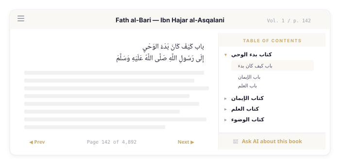
</p>

The book reader is the foundation of everything else. Click any tafsir reference, any sharh link, any narrator biography — and you are reading the original classical Arabic text within seconds.

The reader renders full pages from Turath's digitized library. Each page shows the Arabic text in its original layout with volume and page number references that match the printed editions. A hierarchical table of contents sidebar lets you navigate by chapter and section — click any heading and the reader jumps to the exact page. The sidebar is collapsible and remembers its width across sessions.

Scrolling is infinite. The reader maintains a 40-page render window and lazily loads pages in chunks of 20 as you scroll. When you are within 5 pages of the edge, the next chunk prefetches automatically. The effect is seamless: you can scroll through a 5,000-page book without loading screens.

For mobile, the sidebar collapses to a floating button that opens as a drawer overlay. The reader is fully responsive — Arabic text remains right-to-left with proper font stacks at every viewport width.

At the bottom of the sidebar, a "Chat" tab lets you ask questions about the book you are reading. The system navigates the table of contents, finds relevant sections, and streams an answer with clickable page citations. More on this in the deep dive below.

### Multi-Tafsir for Every Ayah

<p align="center">
  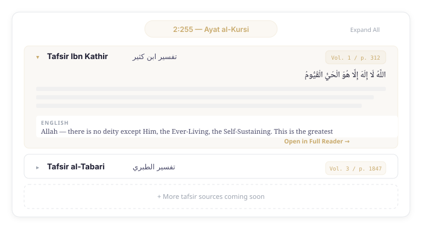
</p>

Pick any ayah in the Quran. The tafsir view shows every available commentary in a collapsible accordion — currently Ibn Kathir and al-Tabari, with more sources planned.

Each accordion entry shows the tafsir source name in English and Arabic, the volume and page number from the printed edition, and the full Arabic commentary text. For Ibn Kathir, an English translation is also available from the QUL dataset. You can expand individual sources, expand all, or collapse all.

The key interaction is **switching between sources while staying on the same verse**. When you switch from Ibn Kathir to al-Tabari, the system resolves the correct `page_index` for that verse in that book. The same ayah might be on page 312 in Ibn Kathir and page 1,847 in al-Tabari — the `tafsir_ayah_map` table handles this lookup. Click "Open in Full Reader" to jump to the full book reader at that exact page.

### Commentary for All Six Hadith Collections

<p align="center">
  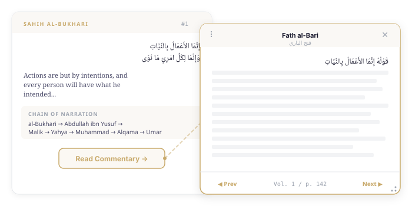
</p>

This is the feature that changes how you use Ilm. Every hadith in every collection now has its classical commentary one click away:

| Hadith Collection | Commentary (Sharh) | Author |
|---|---|---|
| Sahih al-Bukhari | Fath al-Bari | Ibn Hajar al-Asqalani |
| Sahih Muslim | Sharh Nawawi | Imam an-Nawawi |
| Sunan Abu Dawud | Awn al-Mabud | al-Azim Abadi |
| Jami at-Tirmidhi | Tuhfat al-Ahwadhi | al-Mubarakfuri |
| Sunan an-Nasa'i | Sahih Sunan al-Nasai | al-Albani |
| Sunan Ibn Majah | Sunan Ibn Majah (Arnaut ed.) | Ibn Majah / Arnaut |

Click "Read Commentary" on any hadith, and a floating modal opens with the sharh page from the corresponding book. The modal is **draggable** — grab the header and reposition it anywhere on screen. It is **resizable** — drag any edge or corner to adjust the size (minimum 450×350px). It stays within the viewport bounds.

Inside the modal, a chapter sidebar shows the book's heading structure. Page navigation arrows let you read forward and backward. Keyboard shortcuts work: arrow keys for page navigation, Escape to close. A link at the bottom opens the full book reader at the current page.

The significance: you no longer need to leave Ilm to look up what the scholars said about a hadith. The commentary is right there, from the most authoritative classical sources, rendered from the same digitized text that scholars have used for centuries.

### Narrator Biographies from Tahdhib al-Tahdhib

<p align="center">
  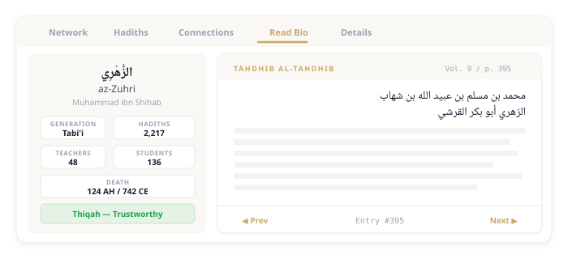
</p>

Every narrator profile now has a "Read Bio" tab. Click it, and you are reading the original entry from Ibn Hajar al-Asqalani's *Tahdhib al-Tahdhib* — the most authoritative biographical dictionary in hadith science, covering the narrators of the six canonical collections.

The entry shows the narrator's full Arabic name, biographical details, and the scholarly assessments (*jarh wa ta'dil*) that Ibn Hajar compiled from dozens of earlier biographical works. The volume and page number match the printed Hyderabad edition.

Why this matters: narrator assessment is the foundation of hadith authentication. Whether a hadith is considered sahih (authentic), hasan (good), or da'if (weak) depends primarily on the reliability of its narrators. Having the original biographical entries accessible directly from the narrator profile — not a summary, not an extraction, but the actual classical text — grounds every assessment in its primary source.

Page navigation lets you read beyond the initial entry. Many narrator entries span multiple pages, and the biography often includes detailed chains of transmission for the assessments themselves.

### Cross-Encoder Search Reranking

<p align="center">
  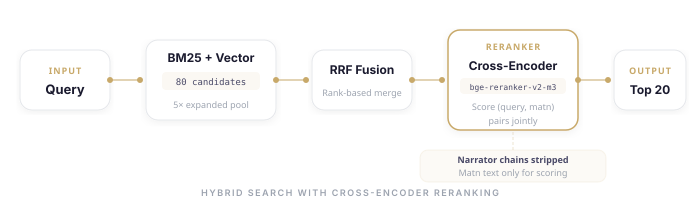
</p>

Part 1 described the hybrid search pipeline: BM25 full-text (English + Arabic) fused with HNSW vector search via Reciprocal Rank Fusion. This works well for most queries, but RRF has a limitation — it fuses results by **rank position**, not by **semantic relevance**. A document ranked #3 by BM25 and #5 by vector gets a combined score regardless of how relevant it actually is to the query.

A cross-encoder fixes this. Unlike the bi-encoder used for initial retrieval (which embeds query and document separately), a cross-encoder takes the **(query, passage) pair together** and produces a single relevance score. This joint encoding is more expensive — you cannot precompute it — but it is more accurate.

The reranking stage activates with `?rerank=true` on the search API. It expands the candidate pool to 5× (minimum 80 results), runs RRF fusion to get a ranked list, then passes the top candidates through the cross-encoder. The final results are re-sorted by cross-encoder scores.

A key design decision: the reranker scores **matn text only**, with narrator chains stripped. Narrator names like Abu Hurayrah and az-Zuhri appear in thousands of hadiths. Including them would let shared narrators dominate the relevance signal, drowning out the actual content similarity.

### Hadith Variant Comparison (Matn Diff)

<p align="center">
  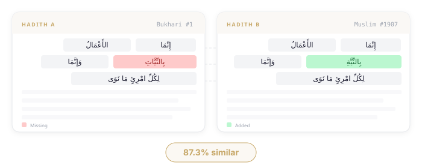
</p>

The same hadith is often transmitted through multiple chains, and each chain can carry slightly different wording. These textual variations (*ikhtilaf al-alfaz*) are a fundamental part of hadith science — they reveal how narrators transmitted text, whether they used exact wording (*riwayah bil-lafz*) or transmitted by meaning (*riwayah bil-ma'na*), and where key differences lie.

The diff feature takes any two hadith texts and produces a word-level comparison using the Longest Common Subsequence (LCS) algorithm. Each word is classified as:

- **Unchanged** — appears in both texts at the same position in the sequence
- **Missing** — appears only in the first text (highlighted red)
- **Added** — appears only in the second text (highlighted green)

A similarity ratio is computed: `(2 × LCS_length) / (total_words_in_both)`, ranging from 0.0 (completely different) to 1.0 (identical). The frontend renders the two texts side by side with right-to-left Arabic layout and color-coded segments.

### Ask AI About Any Book (Book Chat)

<p align="center">
  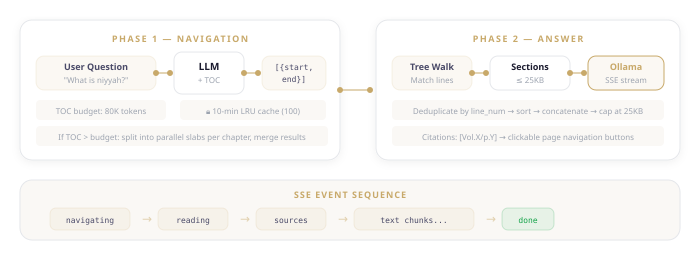
</p>

The book chat lets you ask natural language questions about any of the nine integrated books. Type "What does Ibn Hajar say about the conditions of a sahih hadith?" while reading Fath al-Bari, and the system finds the relevant sections and streams an answer.

This is not simple RAG. These books are thousands of pages long — Fath al-Bari alone has nearly 5,000 pages. You cannot embed the entire book and do vector search over chunks. The content is too dense, too interconnected, and too large for naive chunking.

Instead, the system uses a **two-phase agentic approach**:

**Phase 1 — Navigation**: The LLM receives the book's table of contents (hierarchical, with line numbers) and returns the line ranges most likely to contain the answer. If the TOC is too large (over 80,000 tokens), it is split into parallel slabs (one per top-level chapter), processed concurrently, and the results merged. Navigation results are cached for 10 minutes.

**Phase 2 — Answer**: The system walks the book's tree structure, collects the sections falling within the returned line ranges, concatenates them (capped at 25KB), and streams an answer from Ollama via Server-Sent Events.

Responses include clickable citations like `[Vol. 1 / p. 142]` that navigate directly to the referenced page in the reader. Chat history is persisted per book in localStorage.

### Quote Verification Guard

<p align="center">
  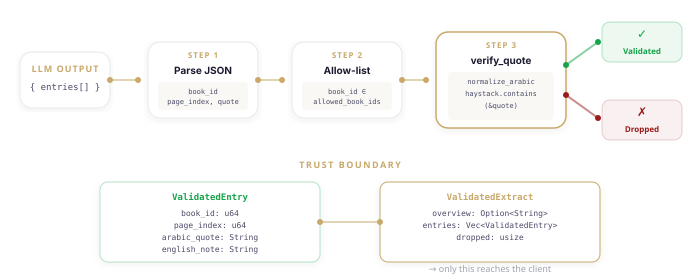
</p>

When the LLM extracts passages from tafsir or sharh books, it can invent quotes or paraphrase — both unacceptable in Islamic scholarship, where fabricating an attribution to the Prophet ﷺ is among the gravest sins.

The quote verification guard ensures that every Arabic quote the LLM claims to have found actually exists in the source page. The pipeline works as follows: the LLM returns structured JSON with `book_id`, `page_index`, `arabic_quote`, and `english_note` for each citation. Each entry is validated against an allow-list of known book IDs — the LLM cannot reference a book that was not in its context. Next, the actual page text is fetched from `page_texts[(book_id, page_index)]`. Finally, `verify_quote()` normalizes both the quoted text and the page text (stripping diacritics, unifying alef variants) and checks whether the quote appears as a substring.

Entries that fail any check — missing fields, unknown book, unknown page, or quote not verbatim — are silently dropped. The `dropped` count is included in the response so the frontend can indicate "N sources could not be verified." Only entries that pass all checks become `ValidatedEntry` objects and reach the client.

---

Every feature above depends on the same foundation: connecting domain objects — ayahs, hadiths, narrators — to specific pages in specific books. The next sections go under the hood, starting with where the data comes from and how it flows through the system.

## The Turath Integration: How It Works

### The Problem

Part 1 built a search tool. But when you find a hadith and want to read the commentary, you need the actual book page — not a summary, not an embedding, but the text as the scholar wrote it. When you find a narrator and want to verify an assessment, you need the biographical dictionary entry. When you read an ayah and want deeper understanding, you need the tafsir page.

These texts exist digitally. [Turath.io](https://turath.io) hosts over 10,000 classical Arabic texts, professionally digitized from printed editions. The API is free, unauthenticated, and provides page-level access to every book.

The challenge is **connecting domain objects to book pages**. A hadith is identified by collection and number (Bukhari #1). A tafsir entry is identified by surah and ayah (2:255). A narrator is identified by a name in Arabic. A book page is identified by a `page_index` (an integer offset within the digitized text). The mapping between these identifiers is not trivial — it requires parsing Arabic headings, matching chapter structures across books, and fuzzy-matching Arabic names with their many orthographic variants.

### Architecture: From API to Reader

<p align="center">
  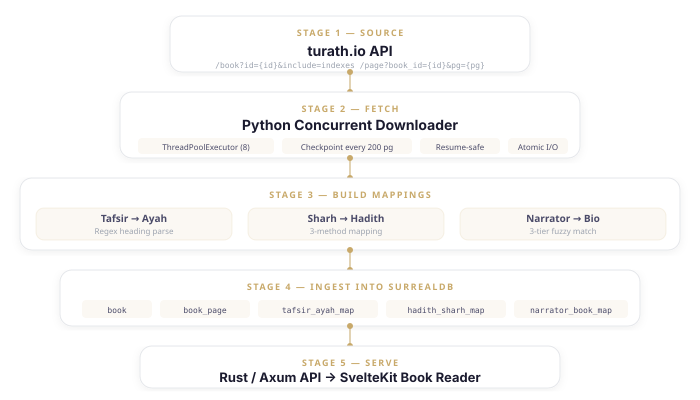
</p>

The pipeline has five stages:

**Stage 1 — Source**: The turath.io API provides two key endpoints:
- `GET /book?id={id}&include=indexes&ver=3` — returns book metadata: title, author, and a hierarchical headings structure with page references
- `GET /page?book_id={id}&pg={page_id}&ver=3` — returns a single page's text content

**Stage 2 — Fetch**: A Python script downloads all pages for each book using a `ThreadPoolExecutor` with 8 concurrent workers. Downloads are resume-safe: progress is checkpointed every 200 pages with atomic JSON writes (write to a temp file, then `os.replace` to swap it in). If the script is interrupted and restarted, it picks up where it left off.

**Stage 3 — Build Mappings**: Three parallel mapping scripts parse the downloaded data to create lookup tables:
- **Tafsir → Ayah**: Parse heading text with regex to extract surah and ayah numbers, producing a mapping from `(surah, ayah, book_id)` to `page_index`
- **Sharh → Hadith**: Use three methods (direct text markers, chapter alignment, interpolation) to map hadith numbers to commentary pages
- **Narrator → Bio**: Fuzzy-match narrator names from the database against biographical dictionary entries using a three-tier strategy

**Stage 4 — Ingest**: A Rust CLI command reads the JSON data and mapping files, then batch-inserts everything into SurrealDB: book metadata, book pages, and all three mapping tables. Ingestion is idempotent — if a book's pages already exist, the command skips it.

**Stage 5 — Serve**: The Axum API exposes endpoints for page retrieval, tafsir lookup, sharh lookup, and narrator biography lookup. The SvelteKit frontend renders pages in the book reader.

### The Database Schema

Five new tables were added to the SurrealDB schema:

```sql
-- Book metadata
DEFINE TABLE IF NOT EXISTS book SCHEMAFULL;
DEFINE FIELD IF NOT EXISTS book_id     ON book TYPE int;
DEFINE FIELD IF NOT EXISTS name_ar     ON book TYPE string;
DEFINE FIELD IF NOT EXISTS name_en     ON book TYPE string;
DEFINE FIELD IF NOT EXISTS author_ar   ON book TYPE string;
DEFINE FIELD IF NOT EXISTS total_pages ON book TYPE int;
DEFINE FIELD IF NOT EXISTS headings    ON book TYPE option<string>;
DEFINE FIELD IF NOT EXISTS category    ON book TYPE option<string>;
DEFINE FIELD IF NOT EXISTS book_type   ON book TYPE option<string>;
DEFINE INDEX IF NOT EXISTS book_id_idx ON book FIELDS book_id UNIQUE;

-- Individual pages
DEFINE TABLE IF NOT EXISTS book_page SCHEMAFULL;
DEFINE FIELD IF NOT EXISTS book_id     ON book_page TYPE int;
DEFINE FIELD IF NOT EXISTS page_index  ON book_page TYPE int;
DEFINE FIELD IF NOT EXISTS text        ON book_page TYPE string;
DEFINE FIELD IF NOT EXISTS vol         ON book_page TYPE string;
DEFINE FIELD IF NOT EXISTS page_num    ON book_page TYPE int;
DEFINE INDEX IF NOT EXISTS book_page_lookup ON book_page FIELDS book_id, page_index UNIQUE;

-- Tafsir ↔ Ayah mapping
DEFINE TABLE IF NOT EXISTS tafsir_ayah_map SCHEMAFULL;
DEFINE FIELD IF NOT EXISTS surah       ON tafsir_ayah_map TYPE int;
DEFINE FIELD IF NOT EXISTS ayah        ON tafsir_ayah_map TYPE int;
DEFINE FIELD IF NOT EXISTS book_id     ON tafsir_ayah_map TYPE int;
DEFINE FIELD IF NOT EXISTS page_index  ON tafsir_ayah_map TYPE int;
DEFINE FIELD IF NOT EXISTS heading     ON tafsir_ayah_map TYPE option<string>;
DEFINE INDEX IF NOT EXISTS tafsir_ayah_book_lookup
    ON tafsir_ayah_map FIELDS surah, ayah, book_id UNIQUE;

-- Sharh ↔ Hadith mapping
DEFINE TABLE IF NOT EXISTS hadith_sharh_map SCHEMAFULL;
DEFINE FIELD IF NOT EXISTS hadith_number ON hadith_sharh_map TYPE int;
DEFINE FIELD IF NOT EXISTS collection_id ON hadith_sharh_map TYPE int;
DEFINE FIELD IF NOT EXISTS book_id       ON hadith_sharh_map TYPE int;
DEFINE FIELD IF NOT EXISTS page_index    ON hadith_sharh_map TYPE int;
DEFINE INDEX IF NOT EXISTS hadith_sharh_lookup
    ON hadith_sharh_map FIELDS hadith_number, collection_id UNIQUE;

-- Narrator ↔ Biography mapping
DEFINE TABLE IF NOT EXISTS narrator_book_map SCHEMAFULL;
DEFINE FIELD IF NOT EXISTS narrator_id ON narrator_book_map TYPE string;
DEFINE FIELD IF NOT EXISTS book_id     ON narrator_book_map TYPE int;
DEFINE FIELD IF NOT EXISTS page_index  ON narrator_book_map TYPE int;
DEFINE FIELD IF NOT EXISTS entry_num   ON narrator_book_map TYPE option<int>;
DEFINE FIELD IF NOT EXISTS book_name   ON narrator_book_map TYPE string;
DEFINE INDEX IF NOT EXISTS narrator_book_lookup
    ON narrator_book_map FIELDS narrator_id, book_id UNIQUE;
```

Every mapping table uses a **composite unique index**. Tafsir is uniquely identified by `(surah, ayah, book_id)` — the same ayah can have entries in multiple tafsir books. Sharh is uniquely identified by `(hadith_number, collection_id)` — the same hadith number in different collections maps to different commentary books. Narrator biography is uniquely identified by `(narrator_id, book_id)` — a narrator could appear in multiple biographical dictionaries.

The `headings` field on `book` stores a JSON-serialized array of the book's heading structure. This is parsed client-side to build the table of contents tree. Storing it as a single JSON field rather than a separate table avoids the overhead of hundreds of small records per book while keeping the heading hierarchy intact.

---

The schema defines *where* mappings live. The harder question is *how* to create them — each mapping type solves a different matching problem, from regex parsing of Arabic headings to fuzzy name matching across orthographic variants. The feature walkthrough showed the user-facing result: click a hadith, see its commentary. Here is how that click resolves to the right page.

## Deep Dive: Mapping Books to Domain Objects

### Tafsir → Ayah Mapping

<p align="center">
  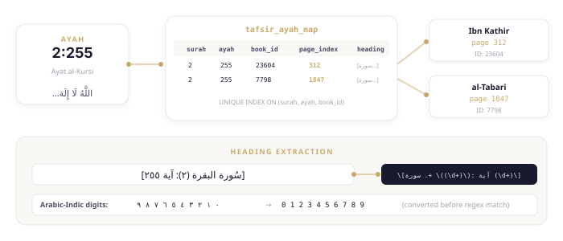
</p>

The tafsir mapping connects each of the 6,236 Quran verses to the specific page in each tafsir book where the commentary for that verse begins.

The approach: parse the heading structure that Turath provides for each book. Tafsir headings follow a consistent Arabic format:

```
[سورة البقرة (٢): آية ٢٥٥]
```

This translates to: "[Surah al-Baqarah (2): Ayah 255]". The surah number and ayah number are embedded in the heading text, sometimes using Arabic-Indic digits (٠١٢٣٤٥٦٧٨٩) instead of Western digits.

The extraction uses multiple regex patterns to handle the variations:

```python
patterns = [
    # [سورة البقرة (٢): آية ١]
    re.compile(r'\[سورة\s+.+?\s*\(([٠-٩\d]+)\)\s*:\s*آية\s+([٠-٩\d]+)\]'),
    # [سورة البقرة (٢): الآيات ٨ إلى ٩]  (verse range)
    re.compile(r'\[سورة\s+.+?\s*\(([٠-٩\d]+)\)\s*:\s*الآيات\s+([٠-٩\d]+)'
               r'\s*إلى\s*([٠-٩\d]+)\]'),
    # [سورة البقرة (٢): الآيات ٤]  (single ayah with الآيات)
    re.compile(r'\[سورة\s+.+?\s*\(([٠-٩\d]+)\)\s*:\s*الآيات\s+([٠-٩\d]+)\]'),
]
```

Arabic-Indic digits are converted to their Western equivalents before parsing:

```python
ARABIC_DIGITS = str.maketrans('٠١٢٣٤٥٦٧٨٩', '0123456789')

def arabic_to_int(s: str) -> int:
    return int(s.translate(ARABIC_DIGITS))
```

Edge cases include:
- **Verse ranges** — "الآيات ٨ إلى ٩" (ayahs 8 to 9): the mapping assigns the page to the first ayah in the range, then subsequent ayahs inherit the same page_index until the next heading
- **Multi-page entries** — some tafsir entries for complex verses span 5–15 pages; the mapping always points to the start page
- **Missing headings** — not every ayah has an explicit heading; the script infers the page from the nearest preceding heading

The mapping file is a JSON dictionary keyed by `"surah:ayah"`:

```json
{
  "1:1": {"page_index": 5, "heading": "[سورة الفاتحة (١): آية ١]"},
  "2:255": {"page_index": 312, "heading": "[سورة البقرة (٢): آية ٢٥٥]"},
  ...
}
```

Ingestion batches records in groups of 200:

```sql
CREATE tafsir_ayah_map SET
    surah = $surah,
    ayah = $ayah,
    book_id = $book_id,
    page_index = $page_index,
    heading = $heading;
```

The same process runs for each tafsir book (Ibn Kathir: 23604, al-Tabari: 7798), producing separate mapping files that are all ingested into the same `tafsir_ayah_map` table. The composite unique index on `(surah, ayah, book_id)` ensures no duplicate entries.

### Sharh → Hadith Mapping: Three Methods

<p align="center">
  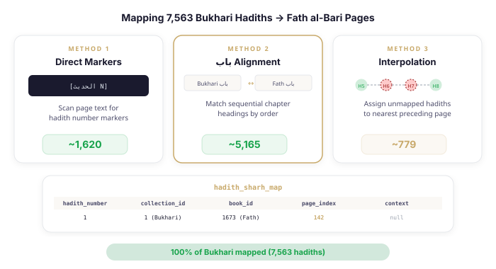
</p>

Mapping hadith commentary is the hardest of the three mapping problems. Unlike tafsir books (which have explicit `[سورة X: آية Y]` headings), sharh books do not always mark which hadith they are discussing. The commentary flows continuously, with hadiths referenced by context rather than explicit markers.

The solution uses three complementary methods, demonstrated here for Fath al-Bari (the commentary on Sahih al-Bukhari):

#### Method 1: Direct Text Markers (~1,620 hadiths)

Some pages contain explicit markers like `[الحديث N]` ("Hadith N"). The script scans every page's text for this pattern:

```python
def method1_direct_markers(pages: list) -> dict[int, int]:
    """Scan page text for [الحديث N] markers."""
    pattern = re.compile(r"\[الحديث\s*(\d+)")
    mapping = {}
    for page in pages:
        page_index = page["page_id"] - 1
        stripped = strip_diacritics(page.get("text", ""))
        for m in pattern.findall(stripped):
            num = int(m)
            if num not in mapping:
                mapping[num] = page_index
    return mapping
```

This produces about 1,620 direct hits for Fath al-Bari — roughly 21% of Bukhari's 7,563 hadiths. These are the highest-confidence mappings.

#### Method 2: Sequential باب Alignment (~5,165 hadiths)

Sahih al-Bukhari is organized into *kutub* (books) and *abwab* (chapters/sections). Fath al-Bari follows the same structure — each باب in Fath corresponds to the same باب in Bukhari, in the same order. The script matches these chapter headings:

```python
def method2_bab_alignment(headings_data, hadith_data):
    """Match sequential باب headings to Bukhari chapter order."""
    headings = headings_data["indexes"]["headings"]
    
    # Extract ordered باب entries from commentary
    bab_pages = []
    for h in headings:
        if re.match(r"\d+\s*-\s*باب", h["title"]) and h["level"] == 2:
            bab_pages.append(h["page"] - 1)  # 0-based

    # Group Bukhari hadiths by chapter, sorted by hadith number
    sorted_chapters = sorted(chapters.items(),
                             key=lambda x: x[1]["min_ref"])

    # Map each chapter's hadiths to corresponding باب page
    for i in range(min(len(sorted_chapters), len(bab_pages))):
        ch_data = sorted_chapters[i][1]
        page_idx = bab_pages[i]
        for ref in range(ch_data["min_ref"], ch_data["max_ref"] + 1):
            mapping[ref] = page_idx
```

This is the workhorse — it maps about 5,165 hadiths (68%). The approach relies on the structural correspondence between Bukhari and Fath al-Bari: both books have the same chapter ordering, so the N-th باب heading in Fath al-Bari corresponds to the N-th chapter in Bukhari.

#### Method 3: Interpolation (~779 hadiths)

After Methods 1 and 2, some hadiths between two mapped points still have no explicit mapping. The interpolation method assigns them the page of the nearest preceding mapped hadith:

```python
def method3_interpolation(combined: dict[int, int]) -> dict[int, int]:
    """Fill gaps using nearest preceding mapped hadith's page."""
    all_refs = sorted(combined.keys())
    additions = {}
    for ref in range(1, BUKHARI_TOTAL + 1):
        if ref not in combined:
            prev_ref = None
            for r in all_refs:
                if r <= ref:
                    prev_ref = r
                else:
                    break
            if prev_ref:
                additions[ref] = combined[prev_ref]
    return additions
```

The logic: if hadith #5 maps to page 142 and hadith #8 maps to page 145, then hadiths #6 and #7 are assigned to page 142 (the nearest preceding mapped page). This fills the remaining ~779 gaps.

**Result: 100% of Bukhari's 7,563 hadiths mapped to Fath al-Bari pages.**

The same three-method pattern is adapted for other collections:
- **Nawawi on Muslim**: similar باب structure to Sahih Muslim
- **Tuhfat al-Ahwadhi on Tirmidhi**: uses numbered hadith markers and chapter alignment
- **Awn al-Mabud on Abu Dawud**: uses باب alignment with Abu Dawud's chapter structure
- **Sahih Sunan al-Nasai**: hadith numbering aligns directly
- **Sunan Ibn Majah (Arnaut edition)**: hadith numbering aligns directly

Each collection has its own mapping script that handles the specific heading format and numbering conventions of that book.

### Narrator → Biography Mapping

<p align="center">
  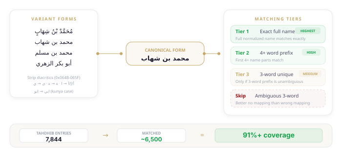
</p>

The narrator mapping connects the 18,000+ narrators in Ilm's graph to their biographical entries in Tahdhib al-Tahdhib. The challenge is Arabic name matching — the same narrator can appear with different diacritics, different alef variants, different spellings of patronymics, and different lengths of their full name chain.

#### Step 1: Normalization

Before any matching, both the narrator names from the database and the entry names from Tahdhib are normalized:

```python
def normalize(s: str) -> str:
    s = strip_diacritics(s)             # Remove tashkeel (0x064B-0x065F)
    s = s.replace("أ", "ا")             # Hamza-above alef → plain alef
    s = s.replace("إ", "ا")             # Hamza-below alef → plain alef
    s = s.replace("آ", "ا")             # Madda alef → plain alef
    s = s.replace("ة", "ه")             # Taa marbuta → haa
    s = s.replace("ى", "ي")             # Alef maqsura → yaa
    s = re.sub(r"\s+", " ", s).strip()  # Collapse whitespace
    return s
```

This collapses the four Unicode representations of "Abu Hurayrah" (أبو هريرة / ابو هريره / أبو هريره / ابو هريرة) into a single canonical form.

#### Step 2: Three-Tier Matching

The matching uses three tiers of decreasing confidence:

**Tier 1 — Exact Full Name**: The full normalized name is looked up in a dictionary built from Tahdhib entries. If exactly one entry matches, it is assigned. This catches narrators whose full name chain (e.g., "محمد بن مسلم بن عبيد الله بن شهاب الزهري") appears identically in both datasets.

**Tier 2 — 4+ Word Prefix**: If the full name does not match, the first 4 words are extracted and matched. Arabic names are chains — a scholar might be known by their first four name parts in one source and their full seven-part chain in another. If the 4-word prefix uniquely identifies one Tahdhib entry, it is assigned. If multiple entries share the same 4-word prefix, the script tries 5-word prefix disambiguation.

**Tier 3 — 3-Word Prefix (Unique Only)**: If Tiers 1 and 2 fail, the script tries matching on the first 3 name words — but **only if this prefix uniquely identifies one entry**. If multiple entries share the same 3-word prefix, the match is skipped entirely. Better no mapping than a wrong mapping.

```python
# Tier 3: Prefix-3 match ONLY if unambiguous
k3 = name_parts(name_to_try, 3)
if k3 in idx_3:
    candidates = idx_3[k3]
    if len(candidates) == 1:
        matched = candidates[0]          # Safe — unique match
    else:
        skipped_ambiguous += 1           # DO NOT match — too risky
```

**Results**: 7,844 entries in Tahdhib al-Tahdhib, approximately 6,500 matched to narrators in Ilm's graph. **91%+ coverage** with zero ambiguous matches. Every mapping is either high-confidence or absent — there are no "probably right" entries.

Why strict matching matters: a wrong narrator-to-biography link undermines scholarly trust in the entire platform. If you click "Read Bio" for az-Zuhri and get someone else's entry, you have done real damage. The cost of an unmapped narrator is low (you just see no "Read Bio" tab). The cost of a wrong mapping is high.

---

With books fetched, mapped, and ingested, the remaining challenge is rendering them. The reader looks simple — Arabic text, table of contents, page navigation — but under the surface it solves three performance problems: rendering 5,000-page books without choking the browser, building navigable hierarchies from flat heading lists, and enabling inline reading without losing your place.

## Deep Dive: The Book Reader

<p align="center">
  
</p>

### Page Rendering Pipeline

Turath pages arrive as raw HTML-like text: `<span>` tags for inline styling, `\n` for line breaks, and `_________` (a line of underscores) as a footnote separator. The `convertPageToHtml()` utility transforms this into semantic HTML:

1. **Split on separator**: Text before `_________` is the main content; text after is footnotes
2. **Block wrapping**: Each line in the main content is wrapped in `<div class="block">` for consistent spacing
3. **Footnote extraction**: Footnote lines are wrapped in `<p class="footnotes">` with distinct styling
4. **Inline preservation**: `<span>` tags from Turath are preserved for inline emphasis and formatting

The rendered HTML uses right-to-left layout (`dir="rtl"`) with Arabic-optimized font stacks. Volume and page number labels (e.g., "Vol. 1 / p. 142") are displayed at the top of each page, matching the printed edition references.

### Infinite Scroll with Virtual Rendering

Loading all pages of a 5,000-page book into the DOM would be prohibitive. The reader uses a **virtual rendering** strategy:

- **Render window**: Only 40 pages are in the DOM at any time — 20 pages above the viewport and 20 below
- **Lazy loading**: Pages are fetched from the API in chunks of 20 (`PAGE_SIZE`). The API endpoint is `GET /api/books/{book_id}/pages?start={start}&size=20`, which returns pages with their text, volume, and page number
- **Scroll tracking**: As the user scrolls, the reader tracks which page is currently in view (`currentPageIndex`) by comparing scroll position to page element offsets
- **Automatic prefetch**: When the current page is within 5 pages of the render window edge, the next chunk is fetched in the background

Pages are cached in a `Map<number, BookPage>` on the client, so scrolling back does not re-fetch. The scroll position restoration on page load uses the URL's `?page={index}` parameter to jump to the correct offset.

### Hierarchical Table of Contents

The table of contents is built from the `headings` field on the `book` record — a JSON array of `{title, level, page_index}` objects. The frontend parses this into a tree:

- **Level 1** headings are top-level expandable parents (e.g., "كتاب بدء الوحي" — Book of the Beginning of Revelation)
- **Level 2+** headings are children that appear only when their parent is expanded

State management uses a `Set<number>` (`expandedSections`) to track which parents are open. Clicking a parent toggles it. Clicking any heading — parent or child — navigates to the exact `page_index` by scrolling the reader content and triggering a page fetch if needed.

The sidebar width and collapsed/expanded state are persisted to `localStorage`, so returning to the same book restores your reading position and sidebar layout.

### The Draggable Modal Reader (BookViewerModal)

The modal reader is designed for inline reading — you want to check a commentary or tafsir without leaving the page you are on.

**Drag system**: The header contains a drag handle (a vertical dots icon ⁝). Pressing the mouse on the header initiates drag tracking: `dragStartX/Y` records the mouse position, `dragStartPanelX/Y` records the panel position, and every `mousemove` event updates `panelX/Y` by the delta. The panel snaps to viewport bounds on release.

**Resize system**: Eight invisible handles surround the panel — one on each edge and one on each corner. Each handle has a CSS cursor hint (`n-resize`, `se-resize`, etc.). Dragging a handle adjusts the panel dimensions in the corresponding direction, with a minimum size of 450×350px and maximum width of 700px. Corner handles resize both axes simultaneously.

**Chapter sidebar**: Inside the modal, a collapsible sidebar shows the book's heading structure. It uses the same expandable tree as the full reader sidebar. Click any heading to navigate to that page within the modal.

**Tafsir source switcher**: When viewing tafsir for a specific ayah, a dropdown lets you switch between Ibn Kathir and al-Tabari. Switching resolves the `page_index` for the current verse in the new book by querying `tafsir_ayah_map`, then loads the correct page. This means you can compare what two classical scholars said about the same verse without leaving the modal.

**Keyboard navigation**: Left/right arrow keys navigate to the previous/next page. Escape closes the modal. During drag or resize operations, a `.is-moving` CSS class disables pointer events on the modal's children to prevent accidental clicks on page content.

---

Browsing is one mode of reading. But sometimes you do not want to scroll through pages — you want to ask a question. "What does Ibn Hajar say about the conditions of a sahih hadith?" The challenge: these books are too large for naive RAG. Fath al-Bari has nearly 5,000 pages. You cannot embed the entire book and vector-search over chunks. The chat feature's two-phase architecture exists because of this scale problem.

## Deep Dive: Agentic Book Chat

<p align="center">
  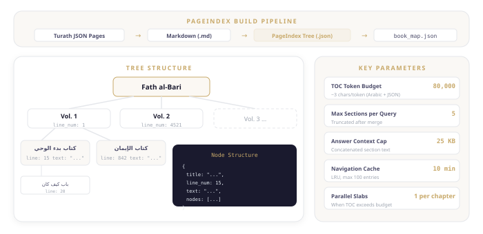
</p>

### The PageIndex Tree

Before the chat system can navigate a book, the book's content must be structured into a searchable tree. The build pipeline converts Turath's JSON pages into this tree in two stages:

**Stage 1 — JSON to Markdown**: For each book, the script reads the downloaded pages and headings, inserts headings at their corresponding page boundaries (mapping Turath heading levels 1–5 to markdown `##` through `######`), appends each page's text, and writes the result as a single markdown file.

**Stage 2 — Markdown to Tree**: The PageIndex library parses the markdown into a hierarchical tree. Each node has:

```json
{
  "title": "كتاب بدء الوحي",
  "line_num": 15,
  "text": "...",
  "nodes": [...]
}
```

The `line_num` corresponds to the line in the intermediate markdown file. This is the anchor that Phase 1 navigation returns and Phase 2 section fetching uses. The tree is serialized to `data/pageindex/{book_id}.json`, and a metadata index at `data/pageindex/book_map.json` maps book IDs to their tree files and metadata (name, line count, markdown path).

### Two-Phase Retrieval

#### Phase 1 — Navigation

The navigation phase formats the tree as an indented table of contents with line numbers:

```
[Line 1] Fath al-Bari
  [Line 15] كتاب بدء الوحي
    [Line 20] باب كيف كان بدء الوحي
    [Line 842] باب الإيمان
  [Line 4521] كتاب الإيمان
    ...
```

This formatted TOC is sent to the LLM (via Ollama) with a system prompt asking it to return JSON line ranges:

```json
[{"start_line": 15415, "end_line": 15500}]
```

**Token budget**: The TOC budget is 80,000 tokens, estimated at ~3 characters per token for Arabic + JSON overhead. If the full TOC fits within budget, a single LLM call is made. If it exceeds the budget (which happens for large books like Fath al-Bari and Tafsir al-Tabari), the TOC is split into **parallel slabs** — one per top-level chapter. Each slab is processed by a separate LLM call concurrently, the results are merged, and the top 5 ranges are kept.

**Validation**: Returned line numbers are checked against the tree — any `start_line` or `end_line` that does not correspond to an actual node in the tree is rejected.

**Caching**: Navigation results are cached in an LRU cache with a 10-minute TTL and a maximum of 100 entries, keyed by `(book_id, question)`. This means asking the same question twice within 10 minutes skips the LLM navigation call entirely.

#### Phase 2 — Section Fetch and Answer

Once line ranges are determined, the system walks the tree recursively, collecting all nodes whose `line_num` falls within any of the returned ranges. The collected sections are deduplicated by `line_num`, sorted by line position, and their text content is concatenated — capped at 25KB to stay within the LLM's context window.

The concatenated text is sent to Ollama with the original question and a system prompt that instructs citation of volume and page numbers. The response is streamed back via Server-Sent Events.

### Streaming Protocol

The SSE stream follows a defined event sequence:

1. `{"status": "navigating"}` — Phase 1 has started, LLM is processing the TOC
2. `{"status": "reading", "sections": [...]}` — Phase 1 complete, sections identified
3. `{"sources": [...]}` — source references for the answer (titles, page numbers)
4. `{"text": "..."}` — streamed answer text chunks (multiple events)
5. `{"done": true}` — stream complete

The frontend `BookChat.svelte` component parses this stream in real-time, rendering each text chunk as it arrives. Post-processing converts citation patterns like `[Vol. 1/p. 142]` into clickable buttons that navigate the reader to the referenced page. Chat history is persisted to `localStorage` keyed by `book_chat_{bookId}`.

---

The book chat navigates *within* a single book. But the search that gets you *to* the right book in the first place also improved. Reranking is invisible to the user — results just feel more relevant. The engineering underneath is where the subtlety lies.

## Deep Dive: Cross-Encoder Reranking

### Why Rerank After RRF

Reciprocal Rank Fusion combines BM25 and vector search results by **rank position**: a document ranked 3rd gets a score of `1/(k+3)` regardless of whether it is extremely relevant or barely relevant. This is effective for combining heterogeneous signals, but it loses the calibrated relevance information that each search method produced.

A cross-encoder jointly encodes the (query, document) pair and produces a single scalar relevance score. Unlike bi-encoders (which embed query and document independently and compare vectors), cross-encoders see the full interaction between query and passage tokens. This makes them more accurate for relevance judgment — but too expensive for initial retrieval over 34,000+ hadiths.

The architecture: use the fast but approximate retrieval (BM25 + vector + RRF) to get a candidate set, then use the slow but accurate cross-encoder to re-sort the candidates.

### Two Reranker Backends

Both backends implement the same contract: `rerank(query, passages) -> Vec<f32>`.

**FastembedReranker** — the local, CPU-based option:

```rust
pub struct FastembedReranker {
    model: Mutex<TextRerank>,
}

impl FastembedReranker {
    pub fn new() -> Result<Self> {
        let model = TextRerank::try_new(
            RerankInitOptions::new(RerankerModel::BGERerankerV2M3)
                .with_show_download_progress(true),
        )?;
        Ok(Self { model: Mutex::new(model) })
    }

    fn rerank(&self, query: &str, passages: &[&str]) -> Result<Vec<f32>> {
        let mut model = self.model.lock().unwrap();
        let results = model.rerank(query, passages, false, Some(BATCH_SIZE))?;
        let mut scores = vec![0.0f32; passages.len()];
        for r in results {
            scores[r.index] = r.score;
        }
        Ok(scores)
    }
}
```

The model (BAAI/bge-reranker-v2-m3) is loaded once at server startup and protected by a `Mutex`. Reranking happens in batches of 64 passages. Scores are meaningful only for ranking within a single query — they are not calibrated across queries.

**OllamaReranker** — the remote, model-flexible option:

The Ollama reranker batches passages in groups of 10, constructs a system prompt asking the model to return `{"scores": [0.0-1.0, ...]}` with exactly one score per passage, parses the JSON response, and clamps scores to [0.0, 1.0]. This is slower but works with any model Ollama supports.

### Integration with Hybrid Search

Reranking is activated via query parameters: `GET /api/search?q=...&type=hybrid&rerank=true`.

When reranking is enabled, the search pipeline adjusts:

1. **Expand candidate pool**: Instead of fetching the final `limit` results, fetch 5× more (minimum 80). This gives the cross-encoder a meaningful pool to reshuffle — if you only rerank 20 results, the reranker cannot surface a document that the initial retrieval ranked 25th.
2. **Run hybrid search**: BM25 English + BM25 Arabic + HNSW vector, fused with `search::rrf()`.
3. **Strip narrator chains**: Before passing to the reranker, the hadith text is stripped of its narrator chain (isnad). Only the body text (matn) is scored.
4. **Rerank**: The cross-encoder scores each (query, matn) pair.
5. **Re-sort**: Results are re-ordered by cross-encoder scores and truncated to the original limit.

### Why Strip Narrator Chains

This is a critical design decision. Consider a query about "prayer at night" (*qiyam al-layl*). Two hadiths might discuss this topic:

- Hadith A: narrated through Abu Hurayrah → az-Zuhri → Malik → al-Bukhari
- Hadith B: narrated through Anas ibn Malik → Qatadah → Shu'bah → Muslim

Both hadiths discuss prayer at night, but their narrator chains are completely different. If the cross-encoder sees the full text (isnad + matn), the shared narrator names across *other* hadiths would create spurious similarity signals — az-Zuhri appears in thousands of isnads, and his name would dominate the relevance score.

By stripping the isnad and scoring only the matn, the cross-encoder focuses on **what the hadith says**, not **who transmitted it**. The narrator chain is still available in the full result — it is just not part of the relevance scoring.

---

Better retrieval reduces noise, but the LLM can still hallucinate. When it extracts passages from tafsir or sharh books, it can invent quotes, paraphrase, or reference pages it was never shown. The final layer of the system ensures that every quote attributed to a source actually appears in that source — verbatim.

## Deep Dive: Quote Verification Guard

### The Problem

In Islamic scholarship, the consequences of fabrication are severe. The Prophet ﷺ said: *"Whoever tells lies about me deliberately, let him take his seat in Hellfire."* (Sahih al-Bukhari, #110). The entire science of hadith — the isnad system, narrator criticism, textual comparison — exists to prevent fabricated attributions.

When the book chat or tafsir extraction system asks the LLM to identify relevant passages, the model returns structured citations: a `book_id`, a `page_index`, an `arabic_quote`, and an `english_note`. The risk is that the model invents a quote that sounds plausible but does not actually appear on the referenced page — or worse, references a page it was never given. A paraphrase is almost as dangerous as a fabrication: if a scholar sees a quote attributed to Ibn Hajar, they expect the exact words.

### The Validation Pipeline

The guard is implemented in `validate_extract_result()` in `book_chat.rs`. Every entry the LLM returns passes through five checks:

```rust
pub fn validate_extract_result(
    raw: serde_json::Value,
    allowed_book_ids: &HashSet<u64>,
    page_texts: &HashMap<(u64, u64), String>,
) -> ValidatedExtract {
```

1. **Parse**: The raw JSON is deserialized into `RawExtract { overview, entries[] }`. Malformed JSON produces an empty extract — the system never panics on bad LLM output.

2. **Require fields**: Each entry must have `book_id`, `page_index`, and a non-empty `arabic_quote`. Entries missing any field are dropped.

3. **Allow-list check**: The `book_id` must be in `allowed_book_ids` — the set of books whose pages were actually provided in the LLM's context. The model cannot reference a book it was not shown.

4. **Page lookup**: The actual page text is fetched from `page_texts[(book_id, page_index)]`. If the page does not exist in the context, the entry is dropped.

5. **Verbatim verification**: The core check — `verify_quote(&arabic_quote, page_text)`:

```rust
pub fn verify_quote(quote: &str, haystack: &str) -> bool {
    let q = normalize_arabic(quote);
    if q.is_empty() {
        return false;
    }
    normalize_arabic(haystack).contains(&q)
}
```

Both the quote and the page text are normalized (diacritics stripped, alef variants unified, taa marbuta normalized, whitespace collapsed), then the quote must appear as a substring of the page text. This tolerates diacritic differences — the same word with or without *tashkeel* will match — while requiring the exact words in the exact order.

### The Trust Boundary

Only entries that pass all five checks become `ValidatedEntry` objects:

```rust
pub struct ValidatedEntry {
    pub book_id: u64,
    pub page_index: u64,
    pub arabic_quote: String,
    pub english_note: String,
}

pub struct ValidatedExtract {
    pub overview: Option<String>,
    pub entries: Vec<ValidatedEntry>,
    pub dropped: usize,
}
```

`ValidatedExtract` is the server's trust boundary — only its fields are forwarded to the client. The `dropped` count tells the frontend how many LLM citations could not be verified, allowing it to display "N sources could not be verified" when the model hallucinated. Per-entry failures are logged with `tracing::warn!` for debugging but never surfaced as errors — the system still returns the good entries alongside the drop count.

The design principle: it is better to show three verified quotes and silently drop two fabricated ones than to show all five and risk a scholar reading words that Ibn Hajar never wrote.

---

Quote verification ensures fidelity when extracting from a single source. The diff tool takes fidelity further — comparing texts across different transmission chains to surface exactly where they diverge.

## Deep Dive: Hadith Variant Diffing

### The LCS Algorithm

The diff engine in `matn_diff.rs` implements word-level Longest Common Subsequence comparison:

```rust
pub fn diff_matn(text_a: &str, text_b: &str,
                 id_a: &str, id_b: &str) -> MatnDiffResult {
```

The algorithm:

1. **Tokenize**: Split both texts by whitespace into word arrays
2. **Build DP table**: `dp[i][j]` stores the length of the longest common subsequence of the first `i` words from text A and first `j` words from text B. Grid size is `(len_a + 1) × (len_b + 1)`
3. **Backtrack**: Starting from `dp[len_a][len_b]`, walk backwards to produce operations:
   - `Match(ai, bi)` — word at index `ai` in A matches word at index `bi` in B
   - `DeleteA(ai)` — word only in A (marked "Missing")
   - `InsertB(bi)` — word only in B (marked "Added")
4. **Merge segments**: Consecutive operations of the same kind are merged into contiguous `DiffSegment`s

A safety guard limits the DP grid to 120,000 cells. If two very long texts would exceed this (e.g., both over 350 words), the algorithm falls back to marking both texts entirely as `Missing`/`Added` rather than risking memory exhaustion.

### Output Structure

```rust
pub struct MatnDiffResult {
    pub hadith_a: String,
    pub hadith_b: String,
    pub segments_a: Vec<DiffSegment>,
    pub segments_b: Vec<DiffSegment>,
    pub similarity_ratio: f64,
}

pub struct DiffSegment {
    pub text: String,
    pub kind: DiffKind,  // Unchanged, Added, or Missing
}
```

The **similarity ratio** is `(2 × LCS_length) / (words_in_A + words_in_B)`. A ratio of 1.0 means the texts are identical; 0.0 means no shared words. Typical variants of the same hadith score between 0.75 and 0.95.

### Scholarly Significance

Matn comparison is a classical hadith science technique. When the same report reaches the collector through different chains, the wording may vary. These variations reveal:

- **Riwayah bil-lafz vs bil-ma'na**: Did narrators transmit the exact words, or the meaning in their own words?
- **Textual stability**: Highly stable text across multiple chains suggests careful preservation
- **Narrator influence**: If one chain consistently adds a phrase that others omit, it may indicate that narrator's personal commentary crept into the transmission

The diff tool makes this analysis immediate: select two hadith variants, see exactly which words differ, and calculate the textual similarity in one step.

---

That covers the engineering — from data ingestion through mapping, rendering, AI navigation, verification, and textual comparison. For reference, here is the complete catalog of integrated books and the API surface that ties everything together.

## The Books: Complete Reference

### Book Configuration

Each book in the system has a `category` (what domain it serves) and a `book_type` (what kind of content it contains):

| Category | Book Type | Mapping Table | Lookup Key |
|---|---|---|---|
| `quran` | `tafsir` | `tafsir_ayah_map` | `(surah, ayah) → page_index` |
| `hadith` | `sharh` | `hadith_sharh_map` | `(hadith_number, collection_id) → page_index` |
| `hadith` | `collection` | `hadith_sharh_map` | `(hadith_number, collection_id) → page_index` |
| `narrator` | `biography` | `narrator_book_map` | `(narrator_id) → page_index` |

The book configuration API (`GET /api/books/config`) returns metadata for all books including:
- Whether chat is enabled (requires a PageIndex tree)
- Default questions tailored to the book type

### API Endpoints

The Turath integration added these API routes:

```
GET  /api/books/config                     → Book metadata + tafsir_books list
GET  /api/books/list                       → All books with summaries
GET  /api/books/{book_id}                  → Book detail with headings
GET  /api/books/{book_id}/pages?start=&size= → Paginated page retrieval
POST /api/books/{book_id}/chat             → Agentic book chat (SSE stream)

GET  /api/quran/surah/{surah}/tafsir-pages → All tafsir pages for a surah
GET  /api/quran/ayah/{surah}/{ayah}/tafsir → Single ayah tafsir with page text
GET  /api/tafsir/ayah/{surah}/{ayah}/all   → Multi-tafsir comparison
POST /api/tafsir/ask                       → Extractive Q&A over tafsir books

GET  /api/hadiths/sharh-pages?book=&numbers= → Batch hadith → sharh lookup
GET  /api/narrators/{id}/books             → Narrator biography references
```

### The Ingestion CLI

Adding a new book is a four-step process:

```bash
# 1. Fetch from turath.io
python3 scripts/fetch_tafsir.py --book-id 23604

# 2. Build mapping (method depends on book type)
python3 scripts/build_hadith_mapping.py

# 3. Ingest into SurrealDB
cargo run -- ingest-turath \
  --pages-file data/tafsir_ibn_kathir_pages.json \
  --headings-file data/tafsir_ibn_kathir_headings.json \
  --book-id 23604 \
  --name-ar "تفسير القرآن العظيم" \
  --name-en "Tafsir Ibn Kathir" \
  --author-ar "ابن كثير" \
  --tafsir-mapping data/tafsir_verse_mapping.json \
  --category quran --book-type tafsir

# 4. Build PageIndex tree (for chat)
python3 scripts/index_books.py --book-id 23604
```

The Makefile provides convenience targets: `make turath-fetch` downloads all books, `make turath-mapping` builds all mappings, `make book-ingest` runs all ingestion commands, and `make pageindex-build` generates all tree structures.

Ingestion is idempotent: if `count(book_page WHERE book_id = $id) > 0`, the command skips that book. This means you can safely re-run the full ingestion pipeline after adding a new book without duplicating existing data.

---

## What's Next

The nine books currently integrated are just the beginning. The architecture is designed so that adding a new source is a data pipeline task, not a code change.

### More Tafsir Sources
- **al-Qurtubi** (*al-Jami' li-Ahkam al-Quran*) — focuses on legal rulings derived from Quranic verses
- **as-Sa'di** (*Taysir al-Karim ar-Rahman*) — accessible modern tafsir widely used for study
- **al-Baghawi** (*Ma'alim at-Tanzil*) — classical tafsir with narrator-based methodology

### More Biographical Dictionaries
- **Mizan al-I'tidal** (adh-Dhahabi) — focuses on criticized narrators, essential for grading weak hadiths
- **Siyar A'lam an-Nubala** (adh-Dhahabi) — comprehensive biographical encyclopedia of notable scholars

### Expanding the Hadith Corpus
- Full ingestion of the **Sanadset 650K** dataset — 650,986 hadith records from 926 books, with complete narrator chains
- This would multiply the narrator graph several times over, from ~450K edges to potentially millions

### Technical Improvements
- **Cross-encoder fine-tuning** on Islamic Q&A pairs from the training pipeline described in Part 1
- **Offline book reader** via SurrealDB's WebAssembly + IndexedDB mode — read books without an internet connection
- **Multi-language translations** — Urdu, French, Turkish, Indonesian translations alongside Arabic and English
- **Collaborative annotations** — shared study notes with @mentions across user groups

---

## Contributing

Ilm is open source. The [repository](https://github.com/arriqaaq/ilm) contains everything needed to build, ingest, and run the platform.

The expansion opportunities since Part 1 have grown:

- **Book mappings** — add mapping scripts for new Turath books (sharh, tafsir, biographical dictionaries)
- **Arabic name matching** — improve the narrator normalization pipeline for better coverage
- **Frontend** — accessibility improvements, mobile reading experience, keyboard navigation
- **Scholarly review** — verify that sharh-to-hadith and narrator-to-biography mappings are correct against printed editions
- **Data quality** — cross-validate tafsir page mappings against multiple printed editions

The books are there. The infrastructure is there. What remains is extending it — more books, more languages, more scholarly review — until the full classical Islamic library is searchable, readable, and accessible to anyone.
